# Rajanya Project Flowchart and Architecture

This document maps the project exactly as it currently exists in the repository.
It separates implemented behavior from planned or placeholder functionality.

## 1. Project Snapshot
  
| Area | Current implementation |
| --- | --- |
| Application type | Single-page frontend application |
| Build tool | Vite 8 |
| UI framework | React 19 |
| Routing | React Router DOM |
| Global state | React Context plus `useReducer` |
| Form handling | React Hook Form |
| Styling | CSS modules by component, Bootstrap, Bootstrap Icons |
| Animation | Framer Motion, GSAP, React Parallax Tilt |
| Product source | Static JavaScript array |
| Authentication storage | Browser `localStorage` |
| Booking storage | Browser `localStorage` |
| Backend/API | Not implemented |
| Database | Not implemented |
| Payment gateway | Planned only |
| AI virtual try-on | UI concept only |
| Active routes | `/`, `/collection`, `/products/:slug` |

## 2. Complete System Architecture

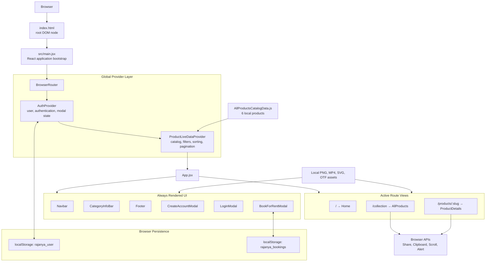

## 3. Application Startup Flow

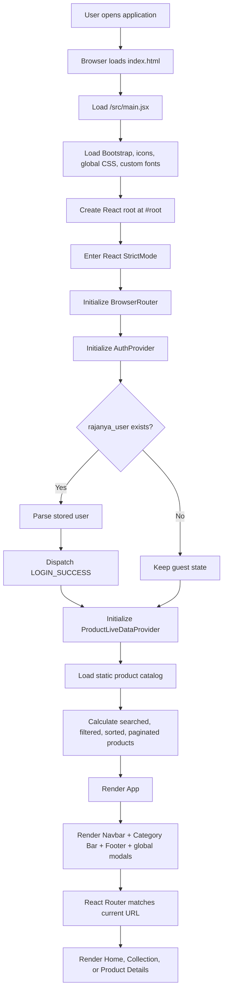

## 4. Top-Level Component Tree

```mermaid
flowchart TD
    App["App"]
    App --> Navbar
    App --> CategoryInfoBar
    App --> Routes
    App --> Footer
    App --> CreateAccountModal
    App --> LoginModal
    App --> BookForRentModal

    Routes --> Home
    Routes --> AllProducts
    Routes --> ProductDetails

    Home --> Hero
    Hero --> AnimatedText
    Home --> MostRentedStyles
    Home --> FashionProcessSection
    Home --> PerfectStyleShowcase
    Home --> AIStylingTrustSection
    Home --> TrendingRentalCollection
    Home --> LimitedTimeDealsSection

    AllProducts --> AllProductsHeroSection
    AllProductsHeroSection --> ProductAnimatedText
    AllProducts --> AllProductsCatalogSection
    AllProductsCatalogSection --> AllProductsCategoryStrip
    AllProductsCatalogSection --> AllProductsSidebarFilters
    AllProductsCatalogSection --> AllProductsSortBar
    AllProductsCatalogSection --> AllProductsProductGrid
    AllProductsProductGrid --> AllProductsProductCard
    AllProductsCatalogSection --> AllProductsPagination

    ProductDetails --> ProductDetailsTopSection
    ProductDetailsTopSection --> ProductDetailsGallerySection
    ProductDetailsTopSection --> ProductDetailsInfoSection
    ProductDetailsTopSection --> ProductDetailsRentalSection
    ProductDetailsTopSection --> ProductDetailsPricingSection
    ProductDetailsTopSection --> ProductDetailsVariantsSection
    ProductDetailsTopSection --> ProductDetailsActionsSection
```

## 5. Active Route Flow

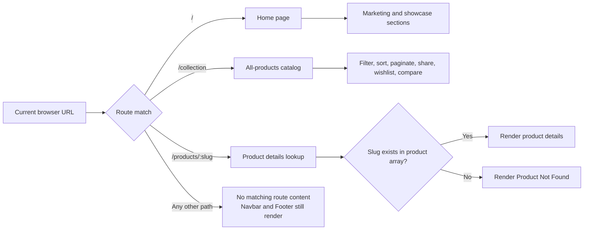

### Active navigation behavior

| Navigation item | Target | Status |
| --- | --- | --- |
| Home | `/` | Working |
| All Product | `/collection` | Working |
| Product card/title/image | `/products/:slug` | Working |
| About Us | `/about` | No active route |
| News | `/blog` | No active route |
| Contact Us | `/contact` | No active route |
| Category info bar links | Category-specific URLs | No active routes |
| Footer links | Mostly `/` | Placeholder |

## 6. Home Page Flow

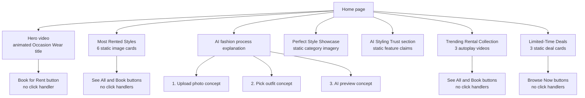

The home page is currently a presentation layer. Its calls to action do not
connect to routing, product state, authentication, booking, or AI services.

## 7. Product Catalog Data Pipeline

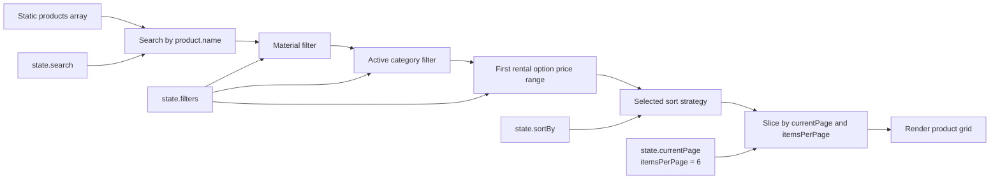

### Product state

```text
products
search
filters.materials
filters.categories
filters.activeCategory
filters.priceRange
sortBy
currentPage
itemsPerPage
wishlist
compare
recentlyViewed
loading
error
```

### Catalog action flow

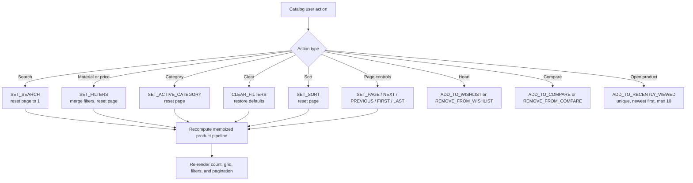

### Sorting rules

| Sort value | Behavior |
| --- | --- |
| `default` | Keep filtered array order |
| `newest` | Reverse current order |
| `oldest` | Keep current order |
| `popular` | Descending `bookingCount` |
| `featured` | Featured products first |
| `priceLowToHigh` | First rental option price ascending |
| `priceHighToLow` | First rental option price descending |
| `highestRated` | Rating descending |

### Current catalog limitations

- The navbar search input is not connected to `state.search`.
- The compare handler exists, but no compare button is rendered on product cards.
- Quick View only records a recently viewed ID and logs it.
- Wishlist and compare state are memory-only and disappear after refresh.
- All six products use the `Lehengas` category, so other category filters return no products.
- Product cards display `product.rentalPrice`, but catalog records only contain `rentalOptions`.
- Sidebar prices use a dollar sign while product details use rupees.
- Category strip is hidden by its base CSS.

## 8. Product Card Interaction Flow

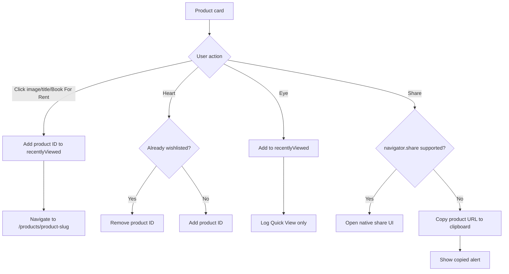

## 9. Product Details Flow

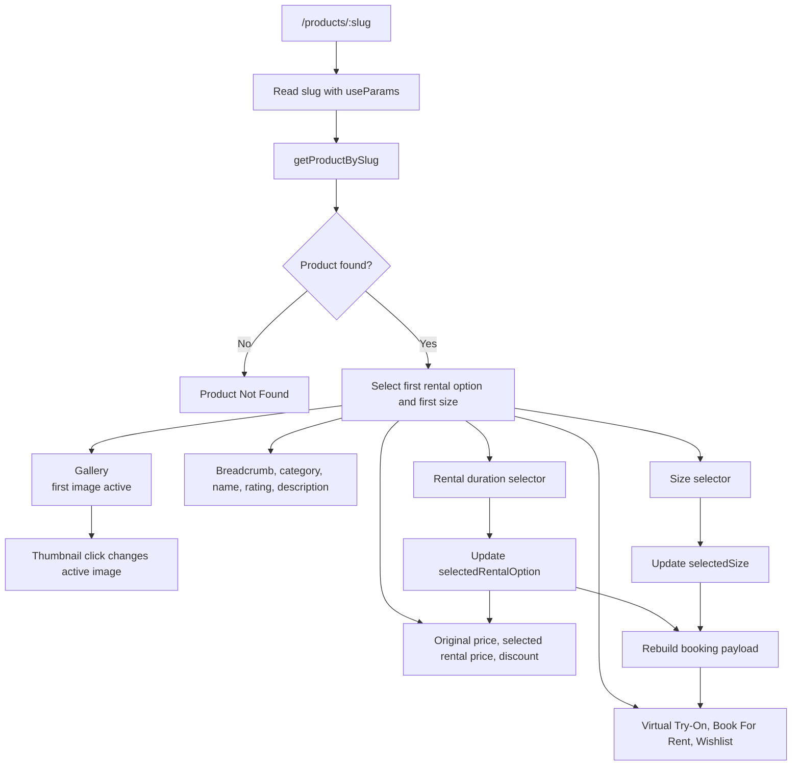

### Booking payload created by product details

```text
product
productId
productName
selectedSize
rentalDuration
rentalPrice
securityDeposit
startDate
returnDate
```

### Product detail action status

| Action | Current behavior |
| --- | --- |
| Change gallery image | Implemented |
| Select rental duration | Implemented |
| Select size | Implemented |
| Dynamic rental price | Implemented |
| Virtual try-on | Console log only |
| Wishlist | Console log only |
| Size guide | Button only |
| Book for rent | Implemented after local authentication |

## 10. Authentication State Machine

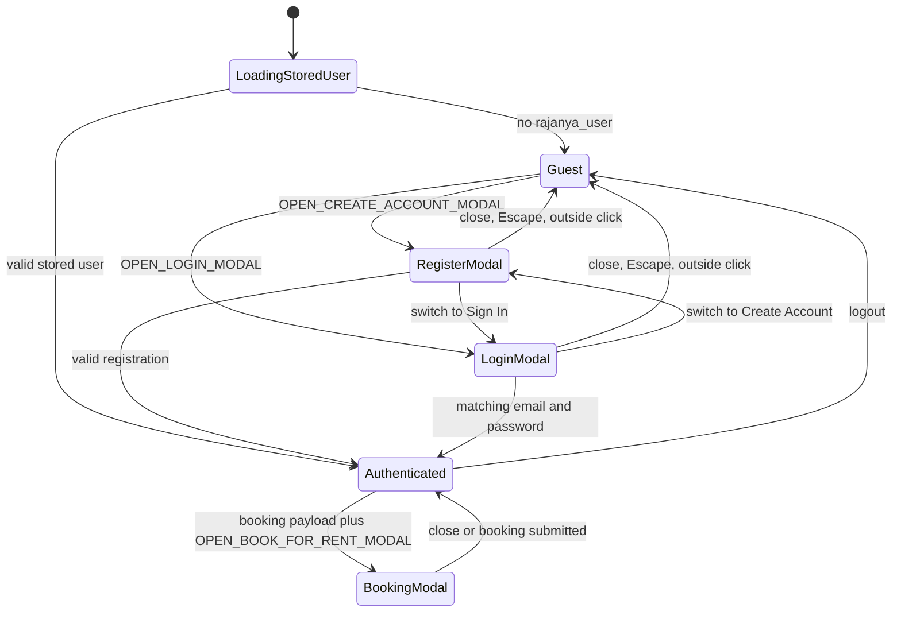

### Authentication state

```text
user
isAuthenticated
loading
error
showCreateAccountModal
showLoginModal
showBookForRentModal
bookForRentPayload
```

### Registration flow

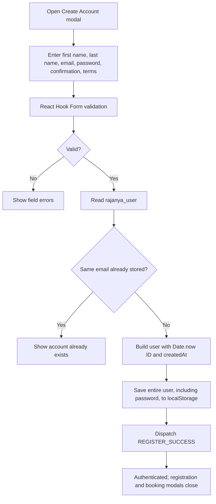

### Login flow

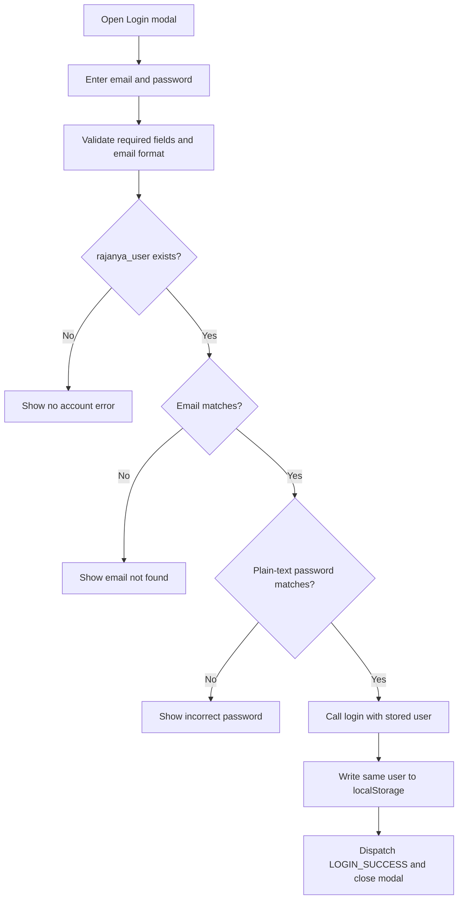

### Authentication limitations

- Only one user can be stored.
- Passwords are stored and compared in plain text.
- There is no server session, token, authorization, or role enforcement.
- The navbar profile button does not open login, registration, or a profile menu.
- No visible UI currently dispatches the initial auth modal action before booking.
- Forgot Password only shows an alert.
- Google login is a visual button only.
- Logout exists in context but is not connected to visible UI.

## 11. Booking Flow

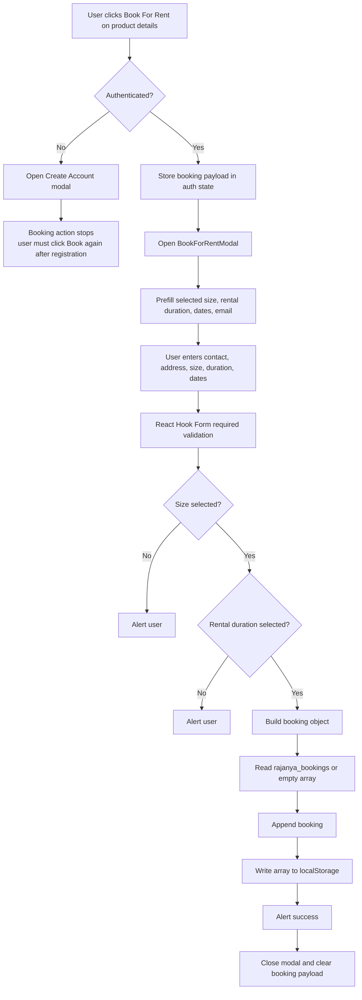

### Stored booking schema

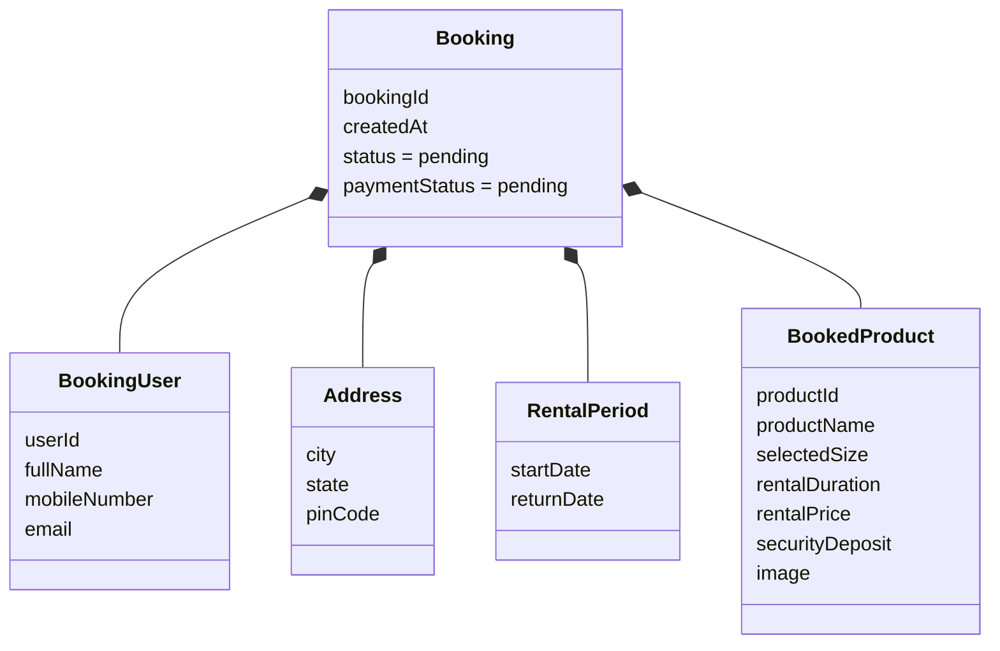

### Booking limitations

- No date validation checks that return date follows start date.
- No availability or stock validation occurs.
- No duplicate-booking or date-conflict check occurs.
- No server booking record exists.
- No payment is collected.
- Booking and payment statuses always start as `pending`.
- The planned Razorpay steps exist only in comments.
- Current-user name prefill expects `currentUser.name`, but registration stores first and last names separately.
- Booking image expects `product.image`, but catalog products store an `images` array.

## 12. Product Data Model

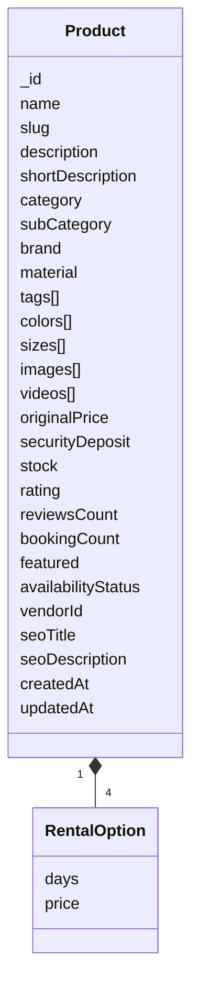

The current catalog contains six products. All are local objects and all belong
to the `Lehengas` category.

## 13. Global State Ownership

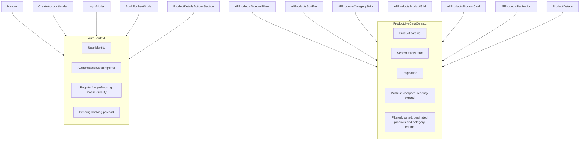

## 14. Browser and External Boundary

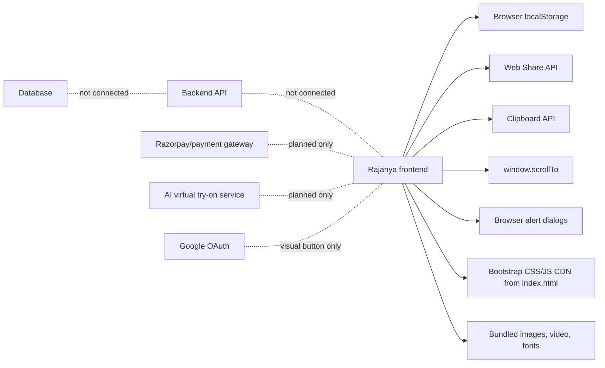

Although packages such as Axios, React Query, Yup, Day.js, UUID, Auto Animate,
React Hot Toast, and React CountUp are installed, they are not part of the
current runtime flow.

## 15. Responsive Layout Flow

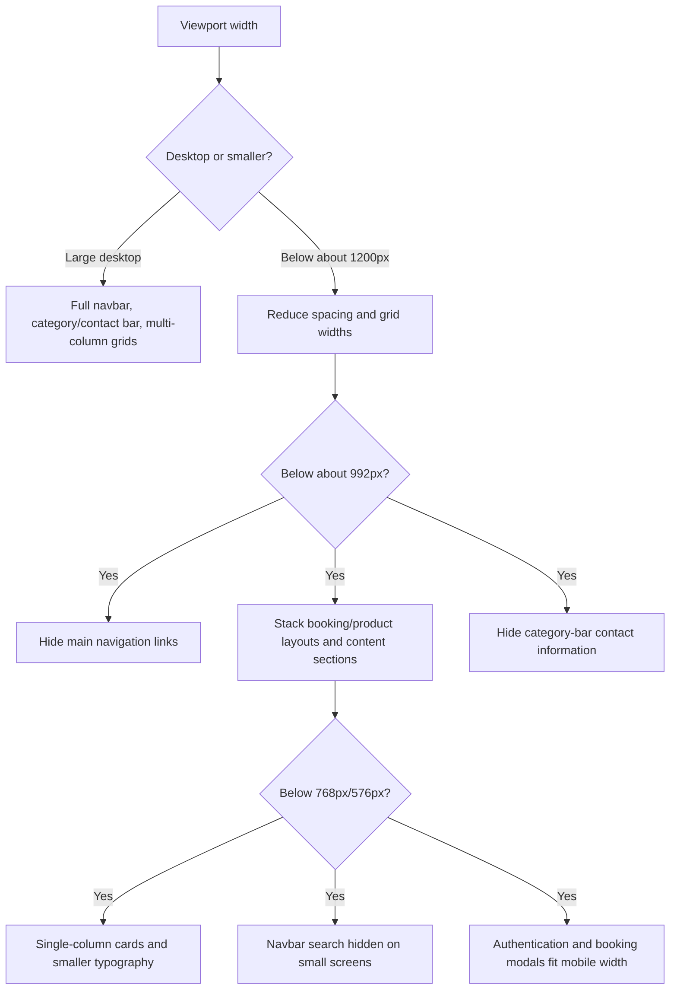

There is no implemented mobile menu to replace the hidden desktop navigation.

## 16. Implemented Versus Planned Modules

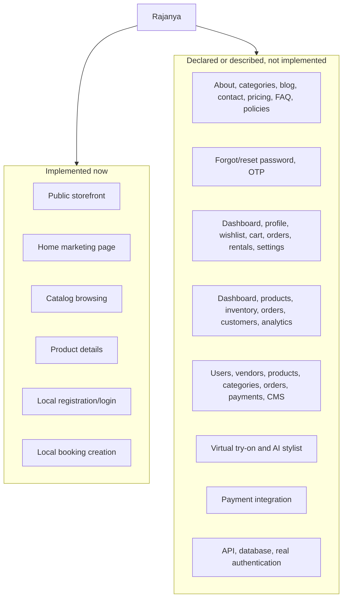

## 17. Planned Role Architecture From Commented Routes

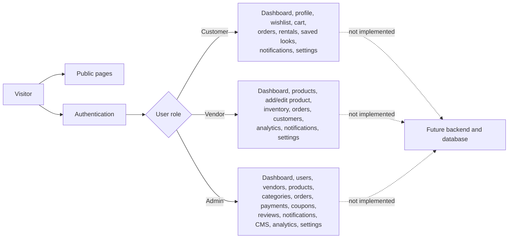

These routes are comments in `App.jsx`; there are no corresponding page
implementations in the current repository.

## 18. Repository Structure

```text
cloth/
|-- public/
|   |-- favicon.svg
|   `-- icons.svg
|-- src/
|   |-- assets/
|   |   |-- fonts/
|   |   |-- video/
|   |   `-- product and promotional images
|   |-- contexts/
|   |   |-- AuthContext.jsx
|   |   `-- ProductLiveDataContext.jsx
|   |-- layouts/
|   |   |-- AdminLayout/
|   |   |-- CustomerLayout/
|   |   |-- PublicLayout/
|   |   `-- VendorLayout/
|   |-- Pages/
|   |   |-- Authentication/
|   |   |-- Home/
|   |   |-- AllProducts/
|   |   `-- ProductDetails/
|   |-- PagesComponents/
|   |   |-- AuthenticationComponents/
|   |   |-- HomeComponents/
|   |   `-- AllProductsComponets/
|   |-- SharedComponents/
|   |   |-- AnnouncementBar/
|   |   |-- CategoryInfoBar/
|   |   |-- Footer/
|   |   |-- Navbar/
|   |   |-- PageLoader/
|   |   |-- PageTransition/
|   |   `-- ScrollToTop/
|   |-- App.jsx
|   |-- App.css
|   |-- index.css
|   `-- main.jsx
|-- index.html
|-- package.json
|-- vite.config.js
`-- eslint.config.js
```

The layout components and several shared components currently contain no
runtime implementation. They are structural placeholders for later work.

## 19. End-to-End User Journey

```mermaid
flowchart TD
    Visit["Visit Rajanya"] --> Home["View home presentation"]
    Home --> Collection["Navigate to All Product"]
    Collection --> Filter["Optionally filter/sort catalog"]
    Filter --> Choose["Choose a product"]
    Choose --> Details["View gallery, details, duration, price, size"]
    Details --> Book["Click Book For Rent"]
    Book --> Auth{"Already authenticated?"}

    Auth -- No --> Register["Create local account"]
    Register --> Retry["Return to product and click Book again"]
    Retry --> Booking

    Auth -- Yes --> Booking["Open booking form"]
    Booking --> Contact["Enter contact and address"]
    Contact --> Schedule["Choose size, rental duration, start and return dates"]
    Schedule --> Confirm["Confirm booking"]
    Confirm --> LocalSave["Save pending booking in localStorage"]
    LocalSave --> Done["Show success alert and close modal"]
```

## 20. Main Technical Risks

1. Authentication is not secure because credentials are stored in plain text in
   browser storage.
2. Bookings are local to one browser and cannot be managed by a real business.
3. Product and booking property names are inconsistent in several components.
4. Many visible links and buttons have no active destination or handler.
5. There is no fallback route or dedicated 404 page.
6. No backend, database, payment, stock, availability, or authorization layer
   exists.
7. Global search is visually present but disconnected from product state.
8. Some text contains mojibake characters caused by encoding issues.
9. Bootstrap is loaded from both npm imports and CDN tags.
10. Dark-mode variables remain from the Vite starter and may conflict with the
    intended design.

## 21. Recommended Production Target Flow

```mermaid
flowchart LR
    React["React frontend"] --> API["Authenticated REST or GraphQL API"]
    API --> AuthService["Authentication and roles"]
    API --> ProductService["Products, inventory, categories"]
    API --> BookingService["Booking and date availability"]
    API --> PaymentService["Payment orders and webhooks"]
    API --> AIService["Virtual try-on jobs"]

    AuthService --> DB[("Database")]
    ProductService --> DB
    BookingService --> DB
    PaymentService --> DB
    AIService --> ObjectStore[("Image/object storage")]

    PaymentService --> Gateway["Razorpay or another gateway"]
    AuthService --> OAuth["Google OAuth"]
    React --> CDN["Media CDN"]
```

This final diagram is a recommendation, not a description of the current
implementation.
